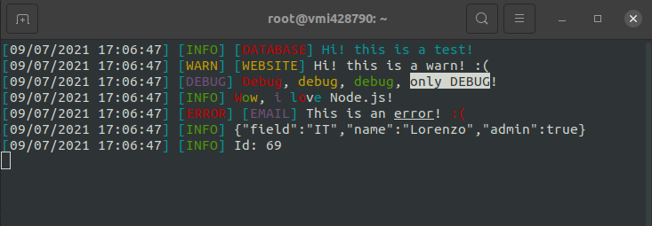

# njs-logger

[](https://www.npmjs.com/package/njs-logger)
[](https://www.npmjs.com/package/njs-logger)
[](https://www.npmjs.com/package/njs-logger)
[](https://www.npmjs.com/package/njs-logger)
[](https://www.npmjs.com/package/njs-logger)
[](https://www.npmjs.com/package/njs-logger)

[](https://www.npmjs.com/package/njs-logger)

## Overview
njs-logger is a **library for Node.js** focused on the **management and manipulation of logs**. This allows, through a few lines of configuration and use, to save on certain files and to show any errors or other useful information on the screen.

<div style="text-align:center">
  
</div>

### Features
- **100% flexible**.
- It is possible to **zip log folders** to save disk space.
- It sends **emails** in case certain events arises.
- **Total management of logs and folders**.
- It is possible to display **messages** with certain **colors**.

> Do you have any suggestions? Create an issue to propose new features!

## Usage
### Installation
It is possible to **install** this library with [npm](https://www.npmjs.com/package/njs-logger):

```bash
npm install nsj-logger
```

To **import** the library in your project:
```js
const logger = require('njs-logger')();
```
### Colors
You can customize your console through the following colors:
- `&0`: black
- `&c`: red
- `&a`: green
- `&e`: yellow
- `&9`: blue
- `&5`: magenta
- `&b`: cyan
- `&f`: white
- `&r`: color reset
- `&k`: hides the characters
- `&x`: intermittent character
- `&z`: blink
- `&n`: underline

To use these colors it is sufficient to insert the code shown in the above list inside a String of a log function (ex: error, debug, log, ecc.).
**Example**:
```js
logger.log("&aThis &fis a &ctest!");
```


### Level
The levels indicate the type of log that can be recalled through the created object, as shown in [this](#usage) section. Specifically, each level has certain attributes, as illustrated in the settings section [[click here](#settings)], which allows you to fully manage the features offered.

Therefore, each level is associated with a function. For example, in the default settings there is a `debug` level, in fact you can execute the following function:
```js
logger.debug("This is a test!");
```

### Target
Targets indicate what particular log to refers to, for example `database`, ` web app`, `bot` and so on. Each target, as shown in the [settings](#settings) section, has a `format` attribute that specifies the style and format of the target.
**Examples**:
```js
logger.log("Test1", "database");
logger.warn("Test2", "email");

// Console: "[07/07/2021 03:47:39] [INFO] [DATABASE] Test1"
//          "[07/07/2021 03:47:39] [WARN] [EMAIL] Test2"
```

### Variables
The library implements a system for managing the variables inserted inside the strings passed as input to the log function.
**Examples**:
```js
logger.log("The user with id: %user_id% is logged in.", {user_id: 69});
logger.warn("%database% -> %table%", "database", {database: "portfolio", table: "staff"});

// Console: "[07/07/2021 03:47:39] [INFO] The user with id: 69 is logged in."
//          "[07/07/2021 03:47:39] [WARN] [DATABASE] portfolio -> staff"
```

## Settings
When the library is imported you can specify some settings according to your needs:

You can find the json schema of the object in this [document]([https://asd](https://github.com/LorenzoVaccher01/njs-logger/blob/main/lib/settingsSchema.json)).

#### debug
>**Data type**: `boolean`
**Default value**: `false`

This settings is used for the library debugging. If set to `true`, useful messages will be displayed for the development of the project.

#### dateFormat
>**Data type**: `String`
**Default value**: `&b[&rGG/MM/YYYY hh:mm:ss&b]&r`

This is the format of the date that is displayed in the console and log files. it is possible to make a combination for the creation of a custom format through the following parameters:
- `ss`: seconds
- `mm`: minutes
- `hh`: hours
- `GG`: day
- `MM`: number of the month (ex: 01 for January)
- `YYYY`: the year with four digits (ex: 2021)
- `YY`: the year with two digits (ex: 21)
 
It is possible to implement colors in the string, which follow the standard illustrated in [this section](#colors).

#### logDirectory
>**Data type**: `String`
**Default value**: `logs/`

It indicates where the logs should be saved. The subfolders of the months will be created in the set folder, as indicated in [months](#months).

#### zipFolders
>**Data type**: `boolean`
**Default value**: `true`

On the first day of each month, it specifies whether folders from previous months should be zipped to save disk space.

#### months
>**Data type**: `array`
**Default value**: `["January", "February", ..., "December"]`

This array indicates the 12 months of the year, used to save log files divided by individual days of the month.

#### levels
>**Data type**: `object`
**Default value**: `{log: {...}, warn: {...}, error: {...}, debug: {...}}`

This object specifies the levels of the log functions. The name associated with the object will be the name of the function used to invoke the function.
Each level must follow the following JSON Schema:
```json
"...": {
  "type": "object",
  "properties": {
    "format": {
      "type": "string"
    },
    "writeToLogFile": {
      "type": "boolean"
    },
    "sendMail": {
      "type": "boolean"
    }
  }
}
```

In other words, each level must have three attributes:
1. `format`: a string that identifies the level which is shown in the log file and console (ex: in the log level the format is the following: `[&b[&aINFO&b]&r]`).
2. `writeToLogFile`: a boolean which indicates whether the string printed on the screen must be written to the log file as well.
3. `sendMail`: a boolean which indicates whether an email should be sent when the current log is invoked. If set to `true`, it is mandatory to set the mail of the settings (see [this section](#mail)).

**Example**:
```json
"log": {
  "format": "&b[&aINFO&b]&r",
  "writeToLogFile": true,
  "sendMail": false
}
```

#### targets
>**Data type**: `object`
**Default value**: `{database: {"format": "&b[&cDATABASE&b]&r"}, website: {"format": "&b[&eWEBSITE&b]&r"}, email: {"format": "&b[&5EMAIL&b]&r"}}`

The targets are used to indicate what the log refers to. This will make it easier to identify, for example, a certain service such as email, website or a possible database error.

#### mail
>**Data type**: `object`
**Default value**: `{    "template": "./views/defaultEmail.ejs", "subject": null, "to": [], "from": null, "host": null, "port": 587, "secure": false, "pool": false, "auth": null}`

This object indicates the settings to send emails if it was specified in a certain [level](#levels) with the `sendMail` setting.

In particular:
1. `template` [`String`]: indicates the file with the `ejs` extension ([see documentation](https://ejs.co/#docs)), used to define the email template. The parameters passed to the ejs file are as follows:
   - `message`: message passed to the log function
   - `from`: indicates the attribute string `mail.from`
   - `date`: the date when the log was invoked
2. `subject` [`String`]: subject of the email
3. `to` [`array`]: array of String used to specify to which emails the notification needs to be sent to
4. `from` [`String`]: [See the documentation](https://nodemailer.com/message/addresses/)
5. `host` [`String`]: IPV4 or DNS of the SMTP server
6. `port` [`number`]: port of the SMTP server 
7. `secure` [`boolean`]: If true the connection will use TLS when connecting to server. If false (the default) then TLS is used if server supports the STARTTLS extension. In most cases set this value to true if you are connecting to port 465. For port 587 or 25 keep it false.
8. `pool` [`boolean`]: set to true to use pooled connections (defaults to false) instead of creating a new connection for every email.
9. `auth` [`object`]: object indicates the login credentials to the SMTP server. Two attributes must be specified in this object:
      - `user` [`String`]: name of the user to access to the SMTP server (typically the email used to send the password).
      - `password` [`String`]: password to access to the SMTP server (typically the password to access the email).